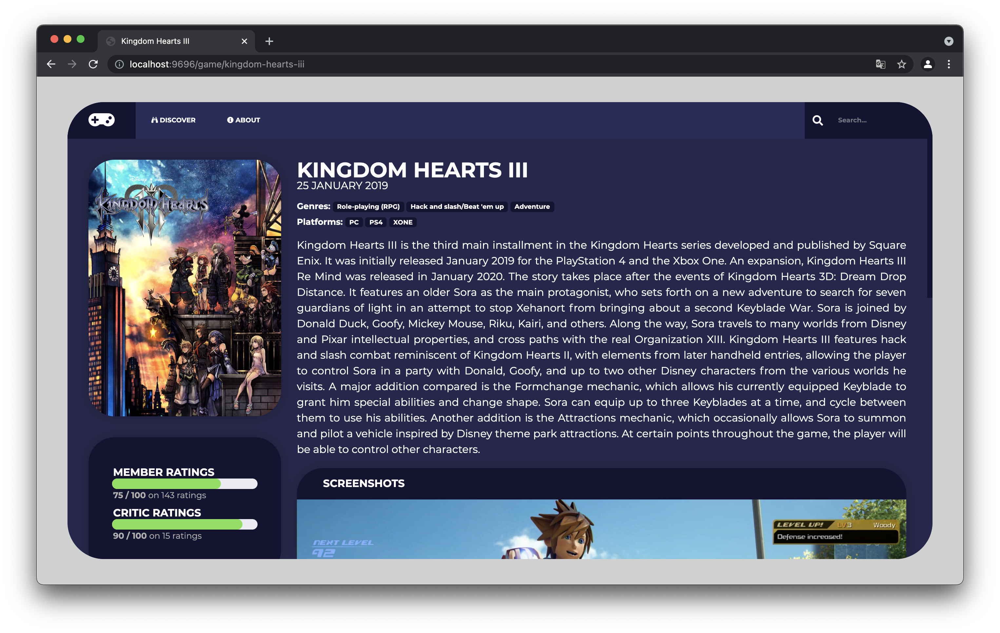

# [WEBR4] Projet



## Les fonctionnalités
### Discover


### My favorites


### Recherche d'un jeu


## Mise en place du serveur
### docker-compose
```bash
$ docker-compose build
```

```bash
$ docker-compose up
```

La plateform est disponible depuis l'adresse `http://localhost:9696`
PHPMyAdmin est disponible depuis l'adresse `http://localhost:6969`

### Telecharger les dépendances
```bash
$ composer install
```

```bash
$ yarn
```

### Compiler les resources (CSS/JS)
```bash
yarn build
```

### Créer et peupler la base de données
Copier le fichier `.env` puis renseigner les parametres de connection à la base de données
```bash
$ cp .env .env.local
```

Créer la base de donnée si elle n'est pas encore crée
```bash
$ bin/console doctrine:database:create
```

Mettre à jour les schema de la base de données
```bash
$ bin/console doctrine:migrations:migrate
```

Peupler la base de données avec les données de igdb.com
```bash
$ bin/console doctrine:fixtures:load
```
